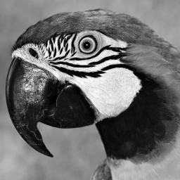
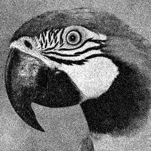

# Lightweight DnCNN Accelerator

## Introduction

This project is a lightweight DnCNN (Denoising Convolutional Neural Network) accelerator designed for image denoising.

| Original Image                       | Noisy Image                   | De-noised Image                      |
| ------------------------------------ | ----------------------------- | ------------------------------------ |
|  |  |  |

## Table of Contents

- [Lightweight DnCNN Accelerator](#lightweight-dncnn-accelerator)
  - [Requirements](#requirements)
  - [Build](#build)
    - [Install dependencies](#install-dependencies)
    - [Train the DnCNN Model](#train-the-dncnn-model)
    - [Quantization](#quantization)
    - [Synthesis](#synthesis)
    - [Build the Project](#build-the-project)
  - [Usage](#usage)
    - [Run RTL Simulation](#run-rtl-simulation)
    - [Run on Pynq Z2 board](#run-on-pynq-z2-board)
  - [Contributors](#contributors)
  - [References](#references)

## Requirements

### Software

- GNU Make
- Python 3.x
- Synopsys VCS (for RTL simulation)
- Xilinx Vivado 2022.1 (for synthesis)

### Hardware

- Xilinx Pynq Z2 board

## Build

You can run the following command to check the available make targets:

```shell
make help
```

### Install dependencies

```shell
pip install -r requirements.txt
```

### Train the DnCNN Model

```shell
make train
```

For more training options, you can run `python model/train.py --help`, and specify the options you want by manually running the script.

There is a **pre-trained** model available in the `model/weights` directory. You can use it directly without training.

### Quantization

```shell
make quantize
```

This will convert the floating-point weights to fixed-point representation suitable for hardware implementation, and extract the model weights into `.hex/.csv` files for simulation and deployment.

There is also a **pre-quantized** model available in the `model/weights` directory. You can use it directly without quantization.

If you are using the pre-quantized model, you still need to extract the weights:

```shell
python model/extract_weights.py [--debug]
```

### Synthesis

Use Vivado to synthesize and generate the `.bit` and `.hwh` files:

```shell
make synth
```

> :warning:
> Make sure you have **Vivado 2022.1** installed and have set the Vivado executable path in your environment variables. The synthesis process may take a long time.

The `.bit` and `.hwh` files will be generated in the `vivado/output` directory.

We also provide a **pre-synthesized** bitstream file. You can use it directly without synthesis.

### Build the Project

After completing the above steps, you can build the project using the following command:

```shell
make build
```

This command will package the following files into `build` directory for deployment on the Pynq Z2 board:

- Bitstream file (`.bit`)
- Hardware handoff file (`.hwh`)
- Jupyter notebook (`.ipynb`) for running the accelerator on the Pynq Z2 board
- Model weights and input data in `.hex` or `.csv` format

> :telescope:
> You can just run `make build` without running the previous steps if you are using the pre-trained, pre-quantized, and pre-synthesized files.
>
> The build process will automatically check if the quantized weights, and synthesized .bit/.hwh files exist.
> If any of them are missing, it will use the provided pre-trained, and pre-synthesized files.

## Usage

### Run RTL Simulation

```shell
cd tests
make
```

This will run the RTL simulation using Synopsys VCS.

The simulation results will be saved in the `tests/out_dat` directory, which contain the output data of each layer of the DnCNN model in `.hex` format, the noisy and de-noised images for visualization.

> :coffee: The simulation will take a long time (about 2 hours) to complete, you may take a coffee break while waiting.

### Run on Pynq Z2 board

1. Copy the `build` directory to the Pynq Z2 board.
2. Open the Pynq Jupyter interface.
3. Execute `build/DnCNN_pynq_run.ipynb` to run the accelerator.

## Contributors

- [`M16134088`](https://github.com/CPC-503)
- [`P76134820`](https://github.com/wayneouow)
- [`M56134010`](https://github.com/HuiHui000)
- [`P76144320`](https://github.com/ryanycs)
- `NN6131045`
- [`P76134244`](https://github.com/linjim2235)

## References

- [Eyeriss: An Energy-Efficient Reconfigurable Accelerator for Deep Convolutional Neural Networks](https://ieeexplore.ieee.org/document/7738524)
- [Beyond a Gaussian Denoiser: Residual Learning of Deep CNN for Image Denoising](https://arxiv.org/abs/1608.03981)
- [DnCNN-PyTorch](https://github.com/SaoYan/DnCNN-PyTorch)
